# Figure 2 Architecture Flow

  
`figure_2.py` 스크립트의 아키텍처와 실행 흐름을 설명합니다.

이 실험은 **Fourier Feature Networks (FFN)**의 주파수 매핑이 이미지 재구성에 미치는 영향을 시각화합니다.
  
---

  

## 1. 전체 아키텍처 개요

  
```mermaid

flowchart TB

subgraph Input["🔹 입력 단계"]

A["input.jpeg<br/>원본 이미지"] --> B["Image Preprocessing<br/>512×512 RGB로 리사이즈"]

B --> C["Coordinate Grid<br/>좌표 생성 x,y ∈ &#40;-1,1&#41;"]

end

  

subgraph Models["🔸 3가지 FFN 모델 비교"]

D["FFN &#40;σ=10&#41;<br/>Random Fourier Features"]

E["FFN &#40;f₀=1&#41;<br/>Single Frequency"]

F["FFN &#40;f₀=0.5&#41;<br/>Single Frequency"]

end

  

subgraph Training["🔹 학습"]

G["fit_image&#40;&#41;<br/>2000 iterations<br/>Adam optimizer"]

end

  

subgraph Output["🔸 출력"]

H["Reconstructed Images<br/>+ DFT 시각화"]

I["figures/figure_2/<br/>PDF 저장"]

end

  

C --> Models

Models --> G

G --> H --> I

```

---
## 2. 논문의 핵심 메시지 (Section 4.1)
  
> **"The set of frequencies that define the base embedding γ(r) completely determines the frequency support of the reconstruction f_θ(r)."**

  
이 실험은 **입력 매핑 주파수 선택**이 재구성 품질에 결정적 영향을 미친다는 것을 보여줍니다.

  
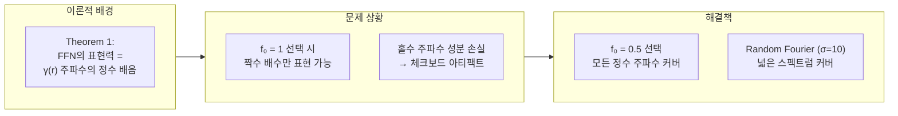

  
---
## 3. FFN (Fourier Feature Network) 모델 구조
 
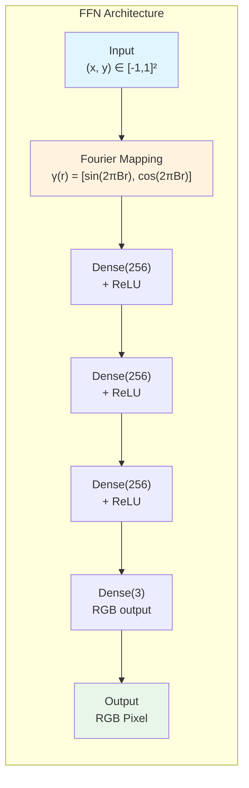

  
### Fourier Mapping 수식

$$\gamma(r) = \begin{bmatrix} \sin(2\pi B \cdot r) \\ \cos(2\pi B \cdot r) \end{bmatrix}$$

여기서 **B 행렬**이 주파수 특성을 결정합니다:

  
| 실험           | B 행렬                      | 주파수 특성                       |
| ------------ | ------------------------- | ---------------------------- |
| RFF (σ=10)   | `10 × N(0,1)` (256×2)     | 랜덤 Fourier Features, 넓은 스펙트럼 |
| BFF (f₀=1)   | `[[1,0],[0,1]]` (2×2)     | 단일 주파수, 짝수 배수만 표현            |
| BFF (f₀=0.5) | `[[0.5,0],[0,0.5]]` (2×2) | 단일 주파수, 모든 정수 주파수 커버         |

---
## 4. 3가지 실험 비교

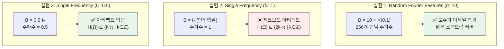

  

---
## 5. 데이터 처리 파이프라인

  
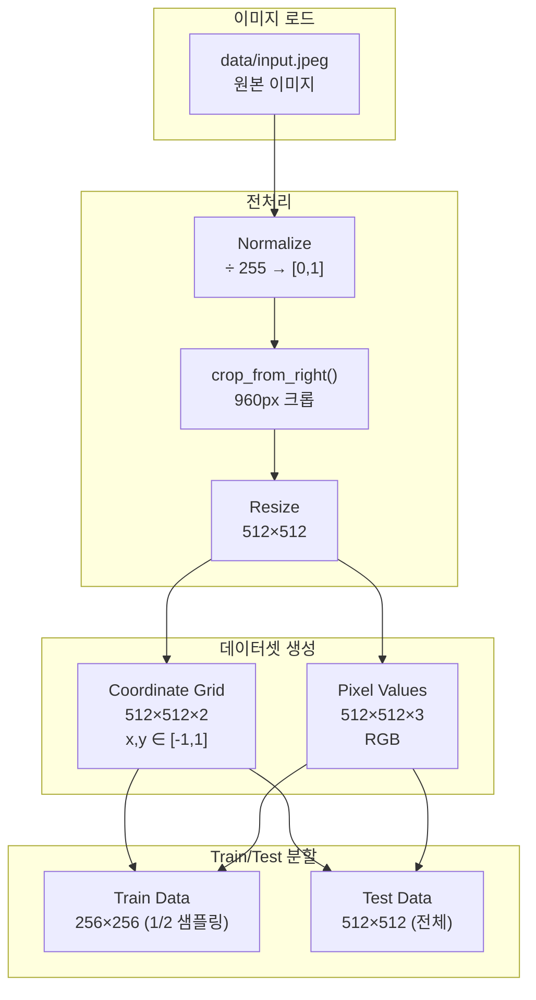

  
### image_to_dataset() 함수 동작


```python

# 좌표 그리드 생성: [-1, 1] 범위
coords = np.linspace(-1, 1, 512)

x_test = np.meshgrid(coords, coords) # 512×512×2


# Train: 1/2 다운샘플링 (256×256)
train_data = [x_test[::2, ::2], img[::2, ::2]]


# Test: 전체 해상도 (512×512)
test_data = [x_test, img]
```


---
## 6. 학습 루프 상세
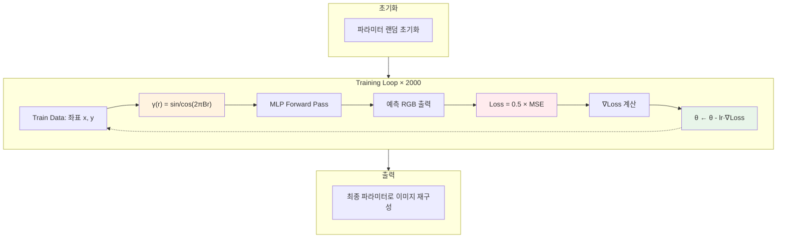
### 학습 하이퍼파라미터

| 파라미터            | 값    | 설명                 |
| --------------- | ---- | ------------------ |
| `iters`         | 2000 | 총 학습 반복 횟수         |
| `learning_rate` | 1e-4 | Adam learning rate |
| `batch_size`    | None | Full batch (전체 픽셀) |
| `log_every`     | 25   | 로깅 주기              |

---
## 7. 출력 시각화

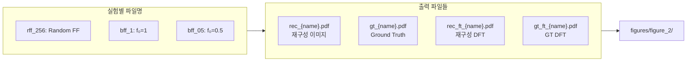

  
### DFT 시각화의 의미

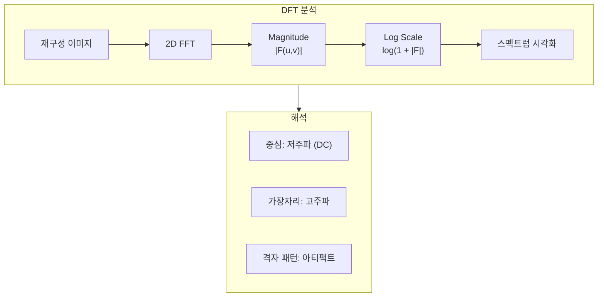

  

---

## 8. 주파수 커버리지 이론

### Theorem 1 적용

논문의 Theorem 1에 따르면, FFN이 표현할 수 있는 주파수 집합 H(Ω)는:

$$\mathcal{H}(\Omega) \subseteq \left\{ \sum_{i} k_i \omega_i \mid k_i \in \mathbb{Z} \right\}$$

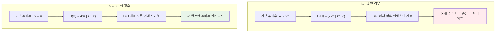

  

---
## 9. 실행 흐름 State Diagram


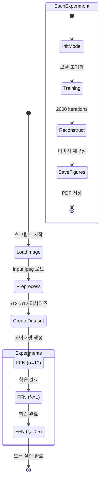

  
---

  

## 10. 코드-개념 매핑

  
| 코드 위치                         | 개념              | 설명                         |
| ----------------------------- | --------------- | -------------------------- |
| `figure_2.py:91-95`           | Image Load      | 이미지 로드 및 전처리               |
| `figure_2.py:98`              | Dataset         | 좌표-픽셀 데이터셋 생성              |
| `figure_2.py:101-111`         | RFF Experiment  | Random Fourier Features 실험 |
| `figure_2.py:115-122`         | BFF f₀=1        | 단일 주파수 (아티팩트 발생)           |
| `figure_2.py:126-133`         | BFF f₀=0.5      | 단일 주파수 (아티팩트 없음)           |
| `models/models_flax.py:46-51` | Fourier Mapping | γ(r) 구현                    |
| `train/standard.py:82-100`    | Training Loop   | Adam 최적화 루프                |
| `utils/graphics.py`           | DFT Plot        | 스펙트럼 시각화                   |

---
## 11. 핵심 인사이트 요약

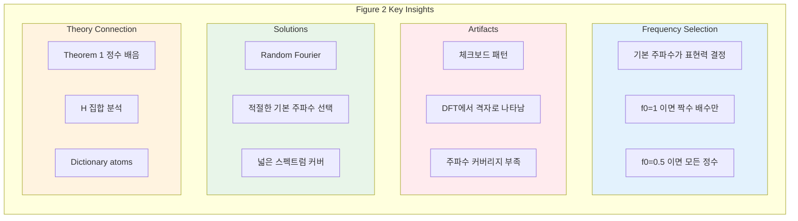
---
## 12. 실험 결과 예측

| 실험           | 예상 PSNR | DFT 패턴   | 시각적 품질     |
| ------------ | ------- | -------- | ---------- |
| RFF (σ=10)   | 높음      | 연속적 스펙트럼 | 고주파 디테일 복원 |
| BFF (f₀=1)   | 낮음      | 격자 패턴    | 체크보드 아티팩트  |
| BFF (f₀=0.5) | 중간      | 연속적 스펙트럼 | 부드러운 재구성   |

---
## 참고 문헌

- Tancik et al., "Fourier Features Let Networks Learn High Frequency Functions in Low Dimensional Domains" (FFN)
- 논문 Section 4.1: "Spatial artifacts stemming from limited frequency support"
- 논문 Figure 2: 원본 실험 결과