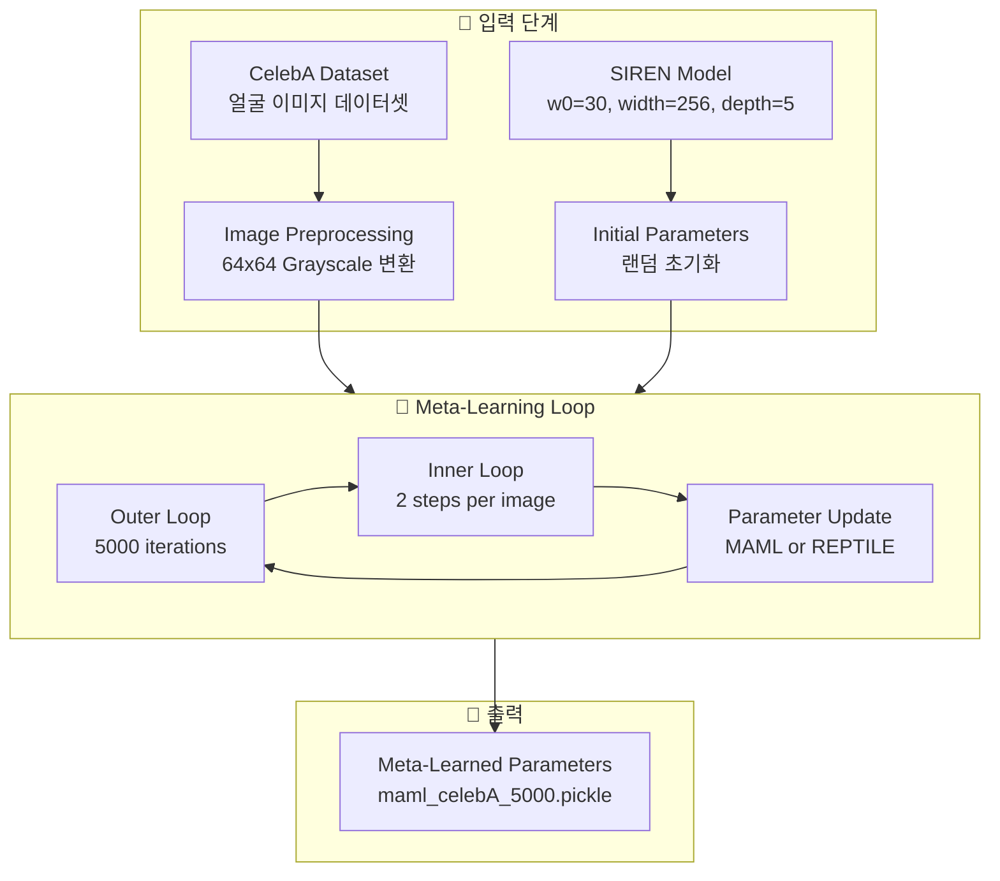
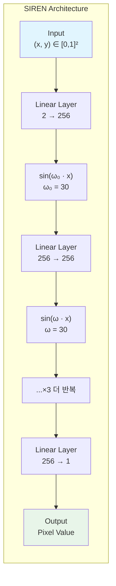
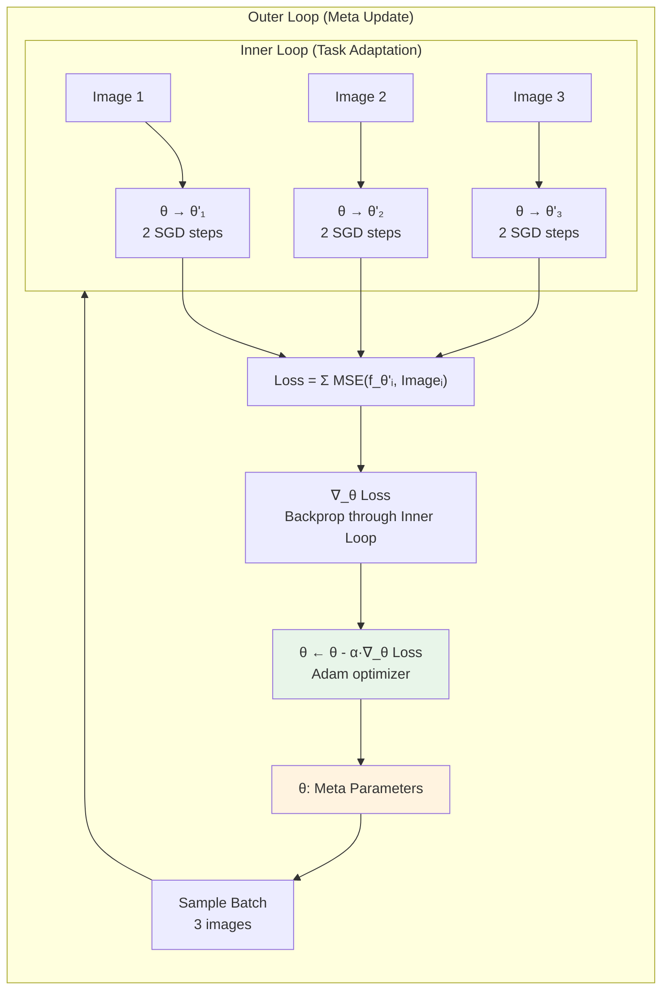
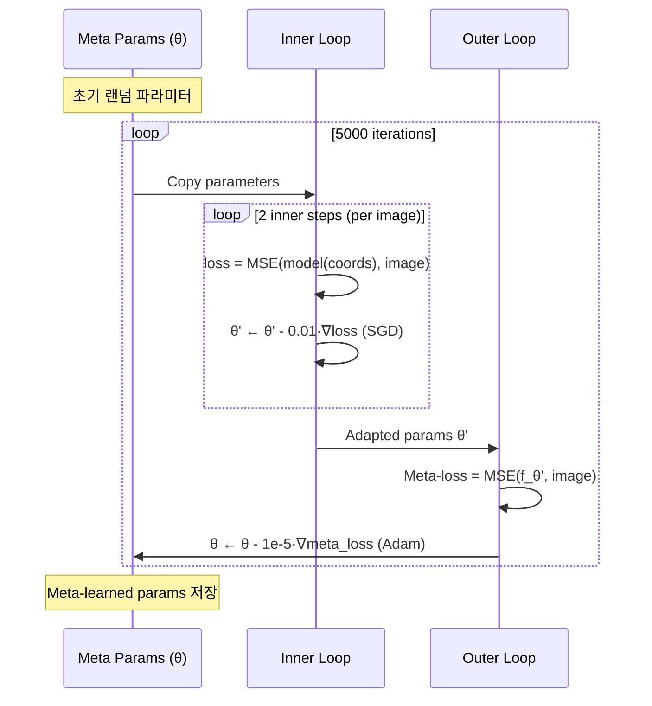
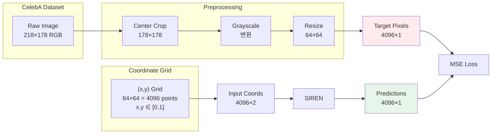
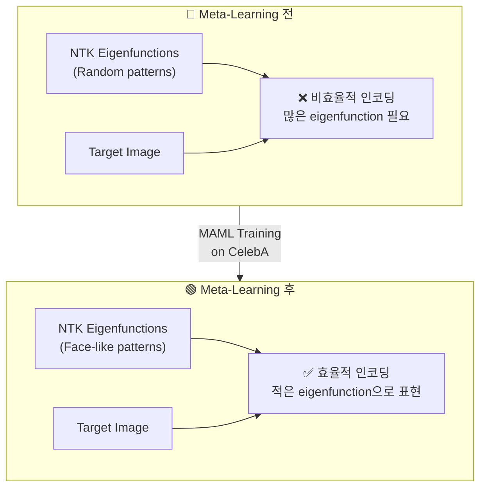
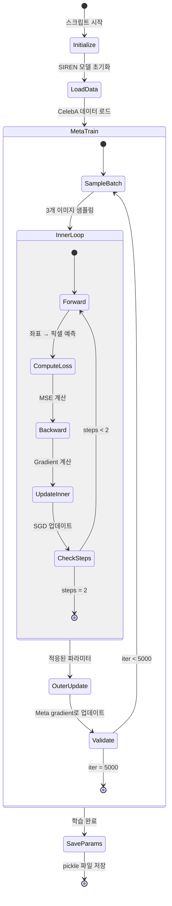
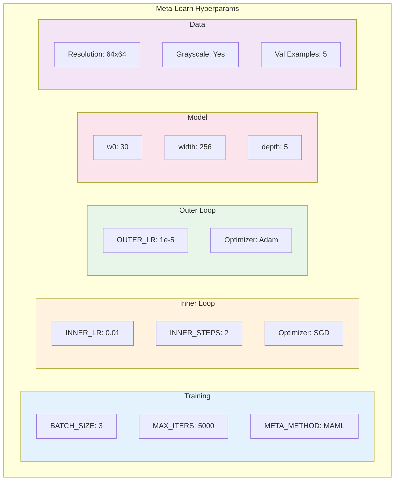
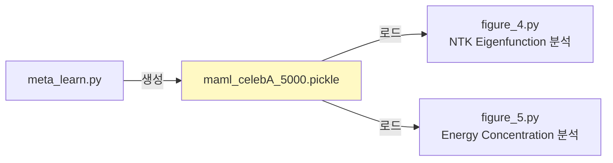

# Meta-Learning Architecture Flow

  
`meta_learn.py` 스크립트의 아키텍처와 실행 흐름을 설명합니다.

---
## 1. 전체 아키텍처 개요

  

  

---
## 2. SIREN 모델 구조

SIREN (Sinusoidal Representation Network)은 좌표 `(x, y)`를 입력받아 픽셀 값을 출력하는 INR입니다.
  

  
### 하이퍼파라미터

| 파라미터        | 값   | 설명                |
| ----------- | --- | ----------------- |
| `w0`        | 30  | 첫 번째 레이어의 주파수 스케일 |
| `hidden_w0` | 30  | 히든 레이어들의 주파수 스케일  |
| `width`     | 256 | 각 레이어의 뉴런 수       |
| `depth`     | 5   | 총 레이어 수           |
 
---
## 3. Meta-Learning 알고리즘 흐름

  
### 3.1 MAML (Model-Agnostic Meta-Learning) 방식
  

  

### 3.2 Inner Loop vs Outer Loop

  

  

---
## 4. 데이터 처리 파이프라인
  

  

---
## 5. 핵심 개념: Dictionary Learning 관점
  
논문의 핵심 통찰은 **Meta-Learning이 Dictionary Learning과 유사하다**는 것입니다.
  

  

### 논문 인용 (Section 5.3)

> "Meta-learning has a reshaping effect on the NTK analogous to dictionary learning, building dictionary atoms as a combination of the examples seen during meta-training."
  

**해석**: MAML로 학습하면 NTK의 eigenfunctions이 얼굴 모양으로 reshape 됩니다. 이로 인해:

- 새로운 얼굴 이미지를 더 빠르게 학습
- 더 적은 gradient step으로 수렴
- 더 좋은 일반화 성능

  

---
## 6. 실행 흐름 상세
  

  
---
## 7. 코드-개념 매핑
  
| 코드 위치                       | 개념               | 설명                       |
| --------------------------- | ---------------- | ------------------------ |
| `meta_learn.py:20-23`       | Model Init       | SIREN 모델 생성 및 파라미터 초기화   |
| `meta_learn.py:25-33`       | Data Load        | CelebA train/val 데이터셋 준비 |
| `train/meta_learn.py:23-38` | Inner Loop       | 태스크별 적응 (2 SGD steps)    |
| `train/meta_learn.py:42-71` | Outer Loop       | 메타 파라미터 업데이트             |
| `train/meta_learn.py:57-67` | MAML Gradient    | 내부 루프를 통한 역전파            |
| `train/meta_learn.py:44-54` | REPTILE Gradient | 파라미터 차이 기반 업데이트          |
| `meta_learn.py:49-50`       | Save Output      | 학습된 파라미터 저장              |
 
---

## 8. 하이퍼파라미터 요약

  
---
## 9. 출력 파일 활용

`maml_celebA_5000.pickle`에 저장된 meta-learned parameters는 다른 실험에서 사용됩니다:
  

  
이 파라미터로 초기화된 SIREN은:

1. **빠른 수렴**: 적은 gradient step으로 새 이미지 학습
2. **NTK 변형**: Eigenfunctions이 얼굴 형태로 reshape
3. **효율적 인코딩**: 적은 eigenfunction으로 얼굴 신호 표현

  

---
## 참고 문헌

- Finn et al., "Model-Agnostic Meta-Learning for Fast Adaptation of Deep Networks" (MAML)
- Sitzmann et al., "Implicit Neural Representations with Periodic Activation Functions" (SIREN)
- Tancik et al., "Meta-learned Neural Neural Representations" (Meta-SDF)